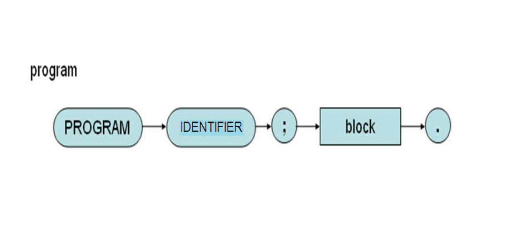
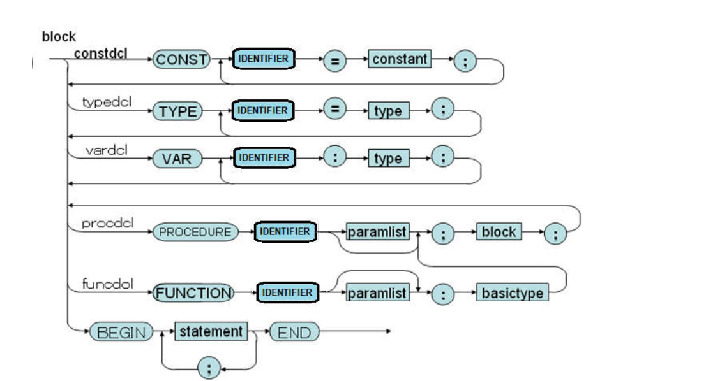
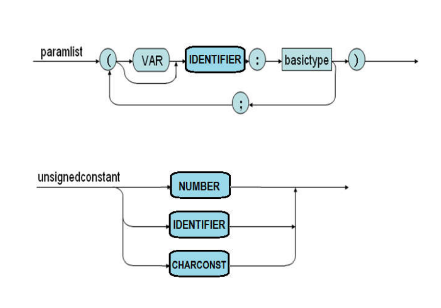
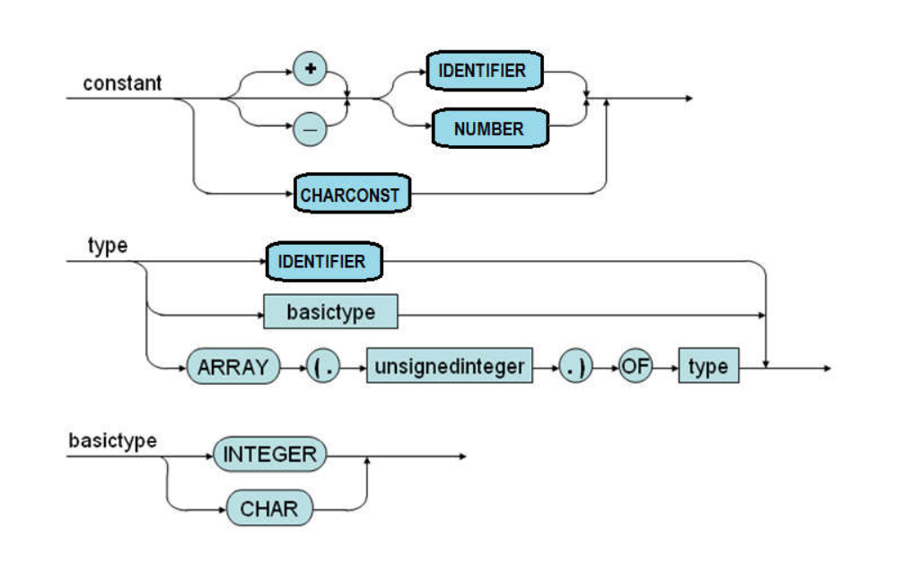
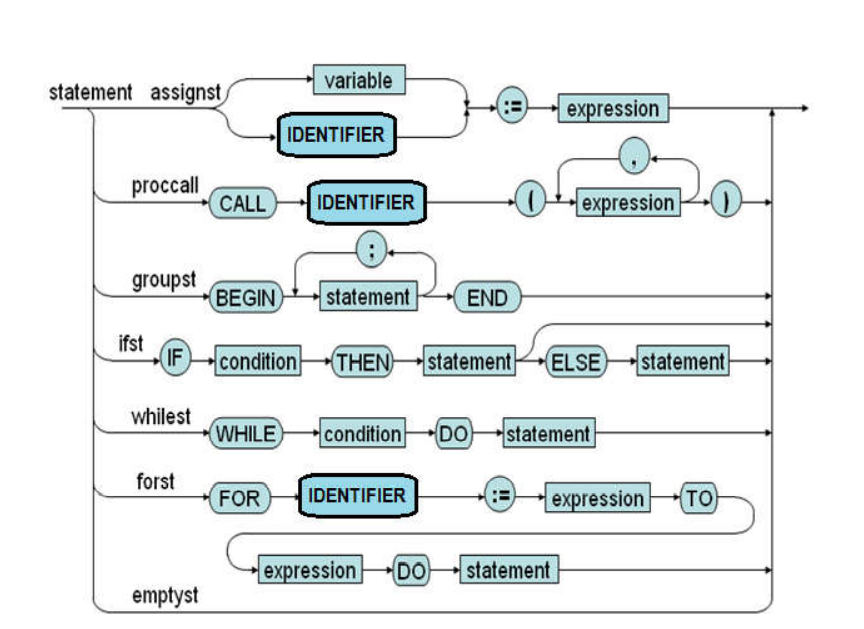
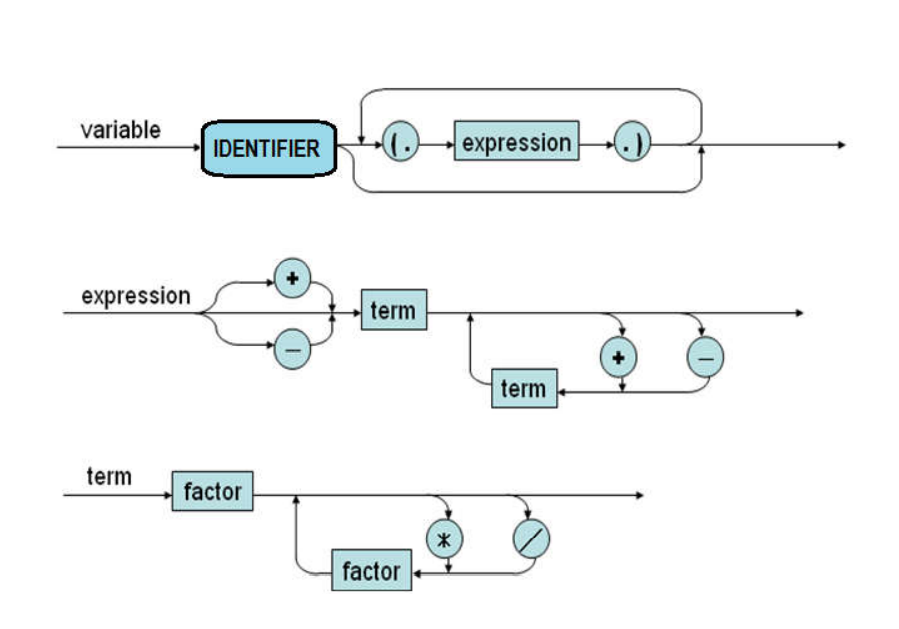
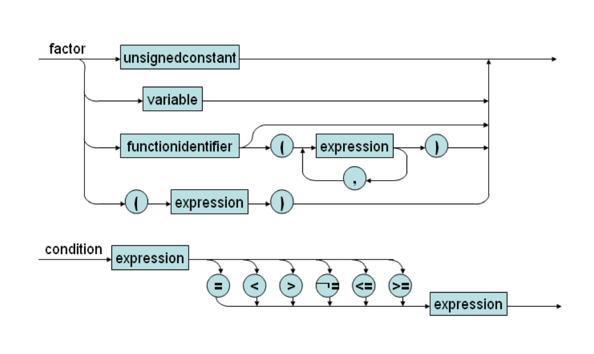

# KPL - Kyoto Programming Language
This is a simple - education programing language written by C.

  <kbd>
    
  </kbd>
  <kbd>
    
  </kbd>
  <kbd>
    
  </kbd>
  <kbd>
    
  </kbd>
  <kbd>
    
  </kbd>
  <kbd>
    
  </kbd>
  <kbd>
    
  </kbd>

## New features

- New operator: power *, mod %
- if-then-else expression
- multiple variable assignment a, b, c := x, y, z
- repeat-until statement
- switch-case statement

You can view all the sample code on /tests folder. 
## How to run
Use 'make' command (on Linux) to compile the code. 

Use completed/kplc to build the sample code on /tests. 

Then run the compiled test file on interpreter/kplrun

Usage: kplrun input [-s=stack_size] [-c=code_size] [-debug] [-dump]
   
   input: input kpl program
   
   -s=stack_size: set the stack size
   
   -c=code_size: set the code size
   
   -debug: enable code dump
